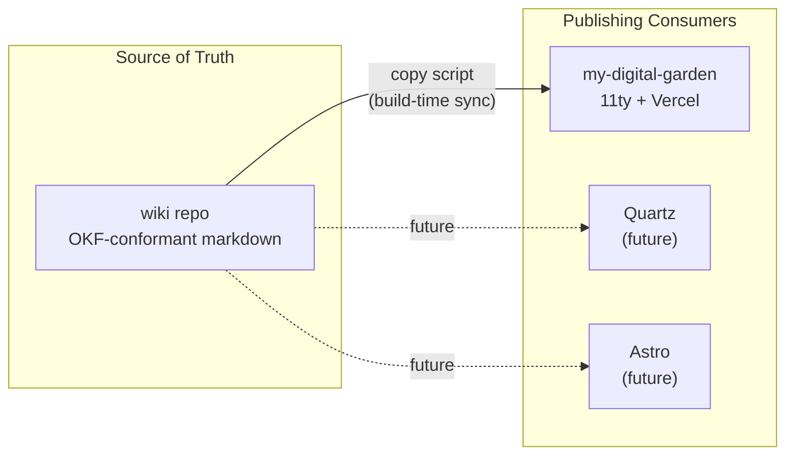

# Wiki Architecture

The system separates **notes** (the source of truth) from **publishing** (how notes reach the web). One central wiki repo feeds multiple static-site consumers; the publishing engine can change without touching the notes.

## Diagram



## Repositories

| Repo | Path | Role | Tech |
|------|------|------|------|
| **wiki** | `C:\Users\maksi\repos\wiki` | Central notes — source of truth | OKF markdown + OpenKnowledge |
| **my-digital-garden** | `C:\Users\maksi\repos\my-digital-garden` | Publishing consumer (current) | 11ty + Vercel |
| (future) | — | Publishing consumer | Quartz or Astro |

## Principles

1. **Notes stay in the wiki repo.** All authoring, editing, linking, and knowledge work happens here. The wiki repo is [OKF-conformant](../external-sources/SPEC.md) — every non-reserved document carries a non-empty `type` in its frontmatter.
2. **Publishing engines are interchangeable.** Each consumer reads from the wiki repo via a sync mechanism (currently a build-time copy script) and renders with its own stack. Adding a new consumer (Quartz, Astro) does not change a single note.
3. **The copy script filters by frontmatter.** Notes with `dg-publish: true` (JSON frontmatter convention from the Digital Garden plugin) are copied to the publishing consumer; the rest stay private in the wiki repo.
4. **OKF conventions keep the wiki portable.** Standard markdown links, YAML frontmatter with `type`, and the reserved `index.md` / `log.md` files mean any OKF consumer can read the wiki without translation.

## Wiki repo structure (OKF)

```
wiki/
├── index.md              → navigation hub (reserved, no frontmatter)
├── log.md                → change history (reserved, no frontmatter)
├── concepts/             → durable ideas and definitions (type: concept)
├── references/           → external sources and citations (type: reference)
├── notes/                → working notes (type: note)
├── external-sources/     → raw sources, verbatim (type: source)
├── research/             → provisional analysis (type: research)
├── articles/             → canonical knowledge (type: article)
├── plans/                → planning documents (type: plan)
└── images/               → image assets
```

## Publishing pipeline

```
wiki repo                copy script              my-digital-garden
─────────────    ──────────────────────    ────────────────────
notes/**/*.md  →  filter dg-publish:true  →  src/site/notes/
images/**      →  copy all               →  src/site/img/user/
```

The copy script runs at build time (locally before `git push`, or in CI). It copies publishable notes from the wiki repo into `my-digital-garden/src/site/notes/`, preserving folder structure. Vercel then deploys the 11ty site.

## See also

- [Personal Wiki Setup — Phased Plan](../plans/personal-wiki-setup-plan.md) — the 8-week roadmap
- [OKF Specification](../external-sources/SPEC.md) — the format the wiki repo conforms to
- [OKF Announcement](https://cloud.google.com/blog/products/data-analytics/how-the-open-knowledge-format-can-improve-data-sharing) — Google Cloud Blog post introducing OKF (raw capture in `external-sources/`)
