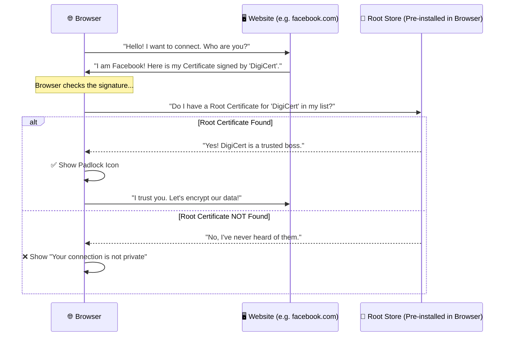
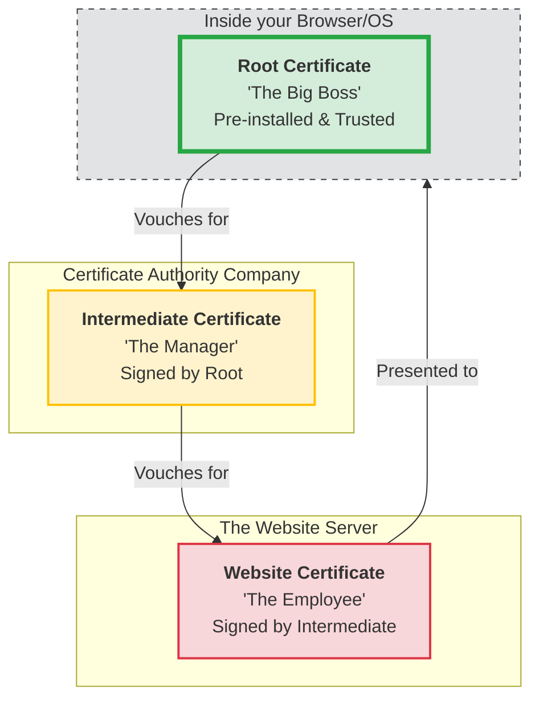

## Explain for 15 yo what is a root certificate in web browser

<Callout type="note" collapsible={false} defaultOpen>

</Callout>

> **TLDR:&#x20;**A Root Certificate is a "pre-approved" digital identity stored in your browser that allows it to trust other certificates without having to ask for permission every single time.

Imagine you are at an airport. You meet a stranger who claims to be a government official. You don’t know this person, so you don’t trust them.

To prove who they are, they show you their **Passport**.

Now, you still don’t know the person, but you **trust the Passport**. Why? Because you trust the **Government** that issued it. You know that the government has a strict process for verifying people before they give out a passport.

In this scenario:

*   **The Person** = The Website (e.g., google.com)
*   **The Passport** = The Website Certificate (SSL/TLS Certificate)
*   **The Government** = The Root Certificate Authority (CA)

Here is the breakdown of how this works in your browser.

---

### 1. The Problem: "Who are you?"

When you type `facebook.com` into your browser, your computer connects to a server. But how does your computer know it’s actually talking to Facebook and not a hacker in a basement who has redirected your traffic to a fake site to steal your password?

The server sends your browser a **Digital Certificate**. This certificate says: *"I am Facebook, and here is my public key to encrypt our conversation."*

### 2. The Trust Problem: "Who says so?"

Your browser looks at that certificate and asks: *"Who issued this? Why should I believe this piece of digital paper?"*

The certificate is signed by a **Certificate Authority (CA)**—a company (like DigiCert or Let's Encrypt) that acts as the "Internet's Notary." Their job is to verify that the person asking for a certificate actually owns the domain.

### 3. The Solution: The Root Certificate

But now we have a new problem: **How do you trust the Certificate Authority?**

This is where the **Root Certificate** comes in.

A Root Certificate is a "Master Certificate." It is the top-level identity of the CA. Instead of the browser asking for proof over and over again, **the Root Certificates are already pre-installed in your browser (or your operating system) by the people who made it (Google, Apple, Microsoft).**

When you install Chrome or macOS, you are essentially downloading a "List of Trusted Bosses." The Root Certificate is the entry on that list.

### 4. The "Chain of Trust" (How it all fits together)

Usually, it’s not just one step. It’s a chain:

1.  **The Root Certificate** (The Big Boss) $\rightarrow$ Trusts...
2.  **The Intermediate Certificate** (The Manager) $\rightarrow$ Trusts...
3.  **The Website Certificate** (The Employee/Website) $\rightarrow$ Trusts...
4.  **The Website** $\rightarrow$ You!

Your browser follows this chain upward. If the chain eventually leads back to a **Root Certificate** that is already saved in your browser's "Trusted List," you see the **little padlock icon** in the address bar. Everything is secure.

### What happens if something goes wrong?

If you visit a website and see a giant red warning saying **"Your connection is not private"** or **"Invalid Certificate Authority,"** it means the chain is broken.

This happens if:

*   The website is using a fake certificate.
*   The certificate was issued by a company that isn't in your browser's "Trusted List."
*   The certificate has expired.

Since the explanation had two parts—the **process** (how the conversation happens) and the **hierarchy** (the chain of trust)—I have created two separate diagrams for you.

### Diagram 1: The Trust Process (The Conversation)

This sequence diagram shows the "back-and-forth" that happens in milliseconds when you load a website.

***

### Diagram 2: The Chain of Trust (The Hierarchy)

This diagram shows how trust flows from the "Big Boss" (Root) down to the website you are visiting.

### Quick Guide to the Diagrams:

1.  **The Sequence Diagram:** Think of this as the **"Security Guard Check."** The browser is the guard, the website is the visitor, and the Root Store is the "Approved Guest List."
2.  **The Hierarchy Diagram:** Think of this as a **"Family Tree of Trust."** The Root is the grandparent. If the grandparent is trusted, then the parent (Intermediate) is trusted, which means the child (Website) is trusted.

## Links
