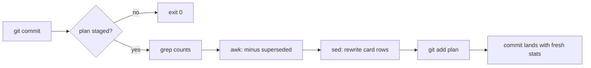

# Auto-updating progress card via pre-commit hook

**Problem:** a progress stat card (```html preview block) inside a markdown plan goes stale as tasks get checked off.
**Solution:** a bash pre-commit hook that greps the checkbox counts and rewrites the card values *in the same commit* — numbers can never lie.
Reusable for any tracked markdown doc with `- [x]` / `- [ ]` checkboxes: plans, migration trackers, runbooks.

## How it works

1. Pre-commit fires → checks if the plan file is staged (skips otherwise, so unrelated commits stay clean).
2. `grep` counts `- [x]` (done) and `- [ ]` (pending).
3. `awk` excludes superseded items: pending checkboxes below a `- [x] ... below —` marker line, up to the next `###` heading (pattern for "old plan text kept for history").
4. `sed` rewrites the card's stat rows, matched by label (`'Total tasks'`, `'Completed'`, `'Remaining'`) — value + subtext fields.
5. `git add` the file → fresh numbers land in the same commit.



## Files

**`scripts/update-plan-stats.sh` (committed):**

```sh
#!/bin/sh
# Refresh the progress stat card in the plan before commit.
# Runs on any platform with sh + grep + awk + sed (Git Bash on Windows).
PLAN="plans/personal-wiki-setup-plan.md"

# Only touch the commit when the plan itself is staged (skip with --force for manual runs)
if [ "$1" != "--force" ]; then
  git diff --cached --name-only | grep -qx "$PLAN" || exit 0
fi
[ -f "$PLAN" ] || exit 0

done_n=$(grep -cE '^- \[x\]' "$PLAN" || true)
todo_raw=$(grep -cE '^- \[ \]' "$PLAN" || true)

# Superseded = pending [ ] items below a "- [x] ... below —" marker, until next ### heading
sup=$(awk '/^### /{s=0} /^- \[x\].*below/{s=1;next} s&&/^- \[ \]/{n++} END{print n+0}' "$PLAN")

total_raw=$((done_n + todo_raw))
todo=$((todo_raw - sup))
total=$((total_raw - sup))
pct=$(( total > 0 ? done_n * 100 / total : 0 ))

sed -i -E \
  -e "s|^(      \['Total tasks', ')[0-9]+(', ')[^']*(')|\1$total\2$total_raw raw - $sup superseded\3|" \
  -e "s|^(      \['Completed', ')[0-9]+(', ')[^']*(')|\1$done_n\2$pct% of plan\3|" \
  -e "s|^(      \['Remaining', ')[0-9]+(')|\1$todo\2|" \
  "$PLAN"

git add "$PLAN"
```

**`.git/hooks/pre-commit` (local-only — hooks never travel with git):**

```sh
#!/bin/sh
exec sh "scripts/update-plan-stats.sh"
```

## Install (one command)

```bash
chmod +x scripts/update-plan-stats.sh && \
{ echo '#!/bin/sh'; echo 'exec sh "scripts/update-plan-stats.sh"'; } > .git/hooks/pre-commit && \
chmod +x .git/hooks/pre-commit
```

Repeat after any fresh clone (hooks live outside version control). Alternative: `git config core.hooksPath scripts/` to point git at a committed hooks dir.

## Reusing on another plan/tracker

- Set `PLAN=` to the target file (repo-relative path).
- The card rows must keep the exact labels `'Total tasks'`, `'Completed'`, `'Remaining'` (sed matches on them) — change labels ↔ change the sed patterns.
- The superseded rule is optional; delete the `sup=` line and the arithmetic if you want raw counts.
- Manual refresh anytime: `sh scripts/update-plan-stats.sh --force` (bypasses the staged-check).

## Verification gate (as applied 2026-07-30)

- Manual `--force` run → card recomputed (171/29/142) ✅
- Idempotent second run → no diff ✅
- Guard: plan unstaged → skip; staged → run ✅
- Real commit fired the hook clean ✅

## Card template used in the plan

```html preview
<div style="font-family:system-ui,sans-serif;padding:20px">
  <div id="cards" style="display:flex;gap:14px;flex-wrap:wrap"></div>
  <script>
    var stats = [
      ['Total tasks', '171', '180 raw - 9 superseded', 'var(--chart-2)'],
      ['Completed', '29', '16% of plan', 'var(--chart-1)'],
      ['Remaining', '142', 'next: 1.6 backup · 1.3-1.4 QMD', 'var(--chart-5)']
    ];
    document.getElementById('cards').innerHTML = stats.map(function (s) {
      return '<div style="flex:1;min-width:150px;padding:16px;background:var(--card);' +
        'color:var(--card-foreground);border:1px solid var(--border);' +
        'border-radius:var(--radius)">' +
        '<div style="font-size:13px;color:var(--muted-foreground)">' + s[0] + '</div>' +
        '<div style="font-size:26px;font-weight:700;margin-top:4px">' + s[1] + '</div>' +
        '<div style="font-size:12px;font-weight:600;margin-top:4px;color:' + s[3] + '">' +
        s[2] + '</div>' +
        '</div>';
    }).join('');
  </script>
</div>
```

Theme tokens (`var(--card)`, `var(--chart-1)` …) come from OK's preview iframe — card tracks light/dark theme automatically.

## See also

- [Personal Wiki Setup — Phased Plan](../plans/personal-wiki-setup-plan.md) — live consumer of this technique
- [Verification-before-completion skill](file:///C:/Users/maksi/.pi/agent/skills/verification-before-completion/SKILL.md) — the gate discipline that caught "stale static numbers" in the first place
