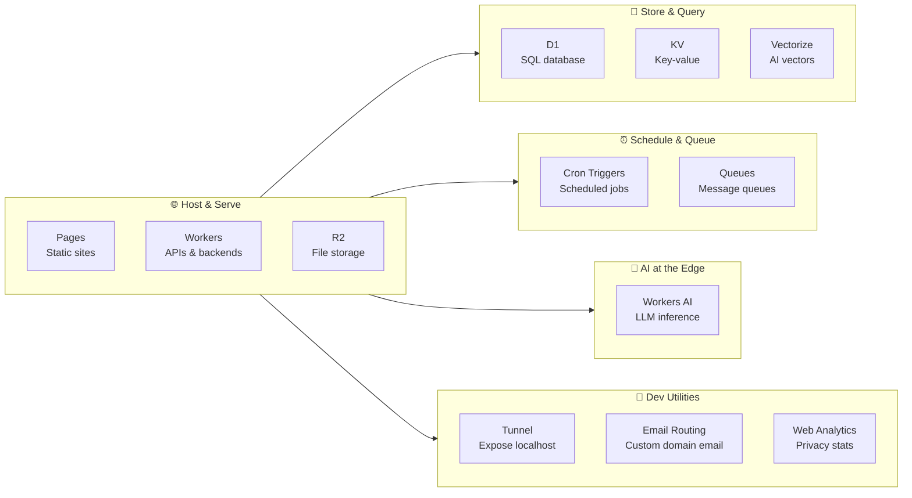
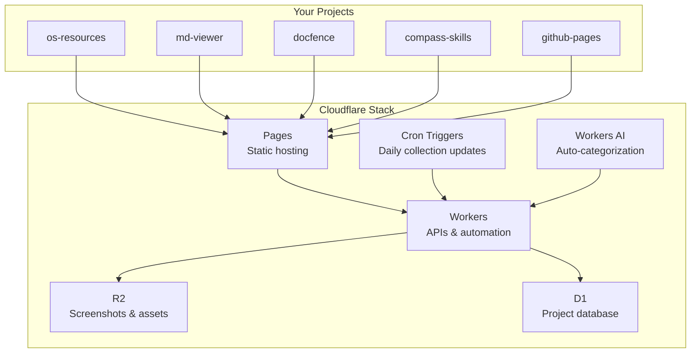

# ☁️ Cloudflare Toolkit for Open Source Tinkerers

> A practical guide to Cloudflare's free & cheap services — with real use cases for your projects.
> Written for someone who builds CLI tools, AI skills, GitHub Pages, and collects/shares open source stuff.

---

## 🧭 Quick Map — What Should You Use?



---

## 🏆 The Big Picture — Free Tier at a Glance

| Service | What It Does | Free Limit | Real-Life Translation |
|---------|-------------|-----------|----------------------|
| **Pages** | Static site hosting | 500 builds/mo, unlimited bandwidth | Host your `os-resources` site, `md-viewer`, docs — zero $ |
| **Workers** | Serverless functions | 100K req/day, 10ms CPU/req | API for your CLI tools, webhook handlers |
| **R2** | Object storage (S3-compatible) | 10 GB, 1M writes/mo, 10M reads/mo | Store screenshots, assets, backups — no egress fees |
| **D1** | SQLite database | 5 GB, 5M rows read/day | Store user data, project configs, analytics |
| **KV** | Key-value store | 1 GB, 100K reads/day, 1K writes/day | Cache, configs, session data |
| **Cron Triggers** | Scheduled jobs | Unlimited triggers (3 per Worker) | Daily scrapers, weekly reports, health checks |
| **Queues** | Message queues | 10K ops/day | Offload heavy processing, decouple services |
| **Workers AI** | LLM inference | 10K Neurons/day (~4K LLM calls) | AI features for your tools |
| **Vectorize** | Vector database | 30M queried dims/mo, 5M stored | RAG for your AI skills |
| **Durable Objects** | Stateful serverless | 100K req/day, 13K GB-s/day | Real-time collaboration, game state |
| **Tunnel** | Expose localhost | Free, unlimited tunnels | Share local dev, webhook testing |
| **Email Routing** | Custom domain email | Free, unlimited forwarding | `you@yourproject.dev` → Gmail |
| **Web Analytics** | Privacy analytics | Free, unlimited | See who visits your open source sites |

---

## 🏠 1. Cloudflare Pages — Your Static Site HQ

**Best for:** Hosting your open source project sites, docs, and tools.

### What it is
GitHub-pages on steroids. Connect your GitHub repo → auto-deploys on every push. Runs on Cloudflare's global CDN (330+ data centers).

### Free tier limits
| Limit | Free | Pro ($5/mo) |
|-------|------|-------------|
| Bandwidth | **Unlimited** | Unlimited |
| Requests | **Unlimited** | Unlimited |
| Builds | **500/mo** (~16/day) | 5,000/mo |
| Projects | **30** | 50 |
| Custom domains | **5 per project** | Unlimited |
| Files per site | **20,000** | 100,000 |

### 🎯 Use cases for YOUR projects

| Your Project | How Pages Helps |
|-------------|----------------|
| **os-resources** | Host the interactive explorer — unlimited traffic, zero cost |
| **md-viewer** | Deploy the Markdown viewer as a live demo site |
| **github-pages** | Migrate here for faster CDN + better build pipeline |
| **docfence** | Host the documentation site with auto-deploy from GitHub |
| **compass-skills** | Publish skill docs and examples |

### Real example
```bash
# Connect your GitHub repo in Cloudflare Dashboard → Pages
# Or use wrangler CLI:
npx wrangler pages project create os-resources --production-branch main

# Every git push auto-deploys. Your site at:
# https://os-resources.pages.dev
# Or your own domain: https://osresources.dev
```

### 💡 Pro tip
Pages Functions let you add serverless backend to your static site. Want a contact form for `os-resources`? Add a `functions/api/contact.js` file in your repo — it runs as a Worker automatically.

**Docs:** https://developers.cloudflare.com/pages/

---

## ⚡ 2. Cloudflare Workers — Serverless Functions on the Edge

**Best for:** APIs, webhooks, backend logic for your tools — without managing servers.

### Free tier limits
| Metric | Free | Paid ($5/mo min) |
|--------|------|-------------------|
| Requests | **100,000/day** | 10M/mo + $0.30/million |
| CPU time | **10ms/invocation** | 30M ms/mo + $0.02/million |
| Duration | No charge | No charge/limit |
| Subrequests | 50/request | 1,000/request |
| Script size | 1 MB | 1 MB |

### 🎯 Use cases for YOUR projects

| Use Case | Example |
|----------|---------|
| **API for os-resources** | A Worker that serves JSON of all your collected resources |
| **Webhook receiver** | GitHub webhook → auto-trigger docfence validation |
| **URL shortener** | `cf.ly/your-project` → redirects to GitHub repo |
| **Form handler** | Contact forms on your static sites |
| **Image optimization** | Resize/compress images on-the-fly for your collections |

### Real example — A simple API for your starred repos
```javascript
// workers/repos-api.js
export default {
  async fetch(request) {
    const repos = await fetch('https://api.github.com/users/MaksimZinovev/starred');
    const data = await repos.json();
    
    return new Response(JSON.stringify({
      total: data.length,
      repos: data.map(r => ({ name: r.name, url: r.html_url, desc: r.description }))
    }), {
      headers: { 'Content-Type': 'application/json' }
    });
  }
}
// Deploy: npx wrangler deploy
// → https://repos-api.your-subdomain.workers.dev
```

### 💡 Pro tip
Workers run in **95ms cold start** (vs 1-5s for AWS Lambda). They're the fastest serverless option out there.

**Docs:** https://developers.cloudflare.com/workers/

---

## 🗄️ 3. Cloudflare R2 — Object Storage (S3 but No Egress Fees)

**Best for:** Storing files, images, backups, and assets without paying to get them back out.

### Free tier limits
| Metric | Free | Paid |
|--------|------|------|
| Storage | **10 GB** | $0.015/GB/mo |
| Class A ops (writes) | **1M/month** | $4.50/million |
| Class B ops (reads) | **10M/month** | $0.36/million |
| Egress | **$0** (always) | **$0** (always) |

### 🎯 Use cases for YOUR projects

| Use Case | Example |
|----------|---------|
| **Screenshot hosting** | Store screenshots for your open source tools |
| **Asset CDN** | Host icons, fonts, images for `os-resources` |
| **Backup storage** | Backup your GitHub repos, configs |
| **File sharing** | Share large files with direct download links |
| **Image bed** | Host images for your READMEs and docs |

### Real example — Free image hosting for your READMEs
```bash
# Install aws-cli configured for R2
aws s3 cp screenshot.png s3://my-bucket/screenshots/ --endpoint-url https://<account>.r2.cloudflarestorage.com

# Public URL (no auth needed to view):
# https://pub-<hash>.r2.dev/screenshots/screenshot.png
```

### 💡 Pro tip
R2 is S3-compatible. Any tool that works with S3 (like `boto3`, `aws-cli`, `rclone`) works with R2. Just change the endpoint URL.

**Docs:** https://developers.cloudflare.com/r2/

---

## 🗃️ 4. Cloudflare D1 — Serverless SQLite Database

**Best for:** When you need a real database but don't want to manage Postgres.

### Free tier limits
| Metric | Free | Paid |
|--------|------|------|
| Storage | **5 GB** | $0.75/GB/mo |
| Rows read | **5M/day** | $0.75/million |
| Rows written | **100K/day** | $0.75/million |
| Databases | **10** | 50 |

### 🎯 Use cases for YOUR projects

| Use Case | Example |
|----------|---------|
| **Project catalog** | Store all your open source projects with metadata |
| **Star tracker** | Track which repos you've starred and why |
| **Skill registry** | Database of your AI skills and their triggers |
| **Analytics store** | Log visits to your open source sites |

### Real example — Track your open source collection
```sql
-- Create a table for your curated resources
CREATE TABLE resources (
  id INTEGER PRIMARY KEY,
  name TEXT NOT NULL,
  url TEXT NOT NULL,
  category TEXT,
  tags TEXT,
  notes TEXT,
  added_at DATETIME DEFAULT CURRENT_TIMESTAMP
);

-- Query from a Worker
export default {
  async fetch(request) {
    const db = env.OSS_DB;
    const { results } = await db.prepare(
      'SELECT * FROM resources WHERE category = ?'
    ).bind('cli-tools').all();
    return Response.json(results);
  }
};
```

### 💡 Pro tip
D1 uses SQLite under the hood. You can export your local SQLite database and import it directly. Great for prototyping locally then deploying.

**Docs:** https://developers.cloudflare.com/d1/

---

## 🔑 5. Cloudflare KV — Global Key-Value Store

**Best for:** Caching, configs, session data — anything that needs fast reads globally.

### Free tier limits
| Metric | Free | Paid |
|--------|------|------|
| Storage | **1 GB** | 1 GB + $0.50/GB/mo |
| Reads | **100K/day** | 10M/mo + $0.50/million |
| Writes | **1K/day** | 1M/mo + $5/million |
| Deletes | **1K/day** | 1M/mo + $5/million |

### 🎯 Use cases for YOUR projects

| Use Case | Example |
|----------|---------|
| **Cache GitHub API** | Cache your starred repos list (avoids rate limits) |
| **Feature flags** | Toggle features in your tools without redeploy |
| **Config store** | Store API keys, settings for your Workers |
| **Redirect map** | Short URL redirects for your projects |

### Real example — Cache GitHub stars to avoid rate limits
```javascript
export default {
  async fetch(request) {
    const cache = await env.CACHE.get('github-stars');
    if (cache) return new Response(cache);
    
    const data = await fetch('https://api.github.com/users/MaksimZinovev/starred');
    const json = await data.json();
    
    // Cache for 1 hour
    await env.CACHE.put('github-stars', JSON.stringify(json), {
      expirationTtl: 3600
    });
    
    return new Response(JSON.stringify(json));
  }
};
```

### 💡 Pro tip
KV is **eventually consistent** (up to 60s delay). For strongly consistent data, use D1 or Durable Objects.

**Docs:** https://developers.cloudflare.com/kv/

---

## ⏰ 6. Cron Triggers — Scheduled Jobs (Free!)

**Best for:** Automating repetitive tasks — scrapers, reports, health checks.

### Free tier limits
| Metric | Limit |
|--------|-------|
| Triggers per Worker | **3** |
| Total triggers per account | **Unlimited** |
| CPU time (Free) | 10ms/invocation |
| CPU time (Paid) | Up to **15 min**/invocation |

### 🎯 Use cases for YOUR projects

| Use Case | Example |
|----------|---------|
| **Daily GitHub scraper** | Collect new starred repos, update your collection |
| **Weekly report** | Generate stats about your open source projects |
| **Health check** | Ping your sites, get alerts if they're down |
| **Backup trigger** | Schedule R2 backups of your data |
| **Social poster** | Auto-post about new projects to Twitter/Bluesky |

### Real example — Daily starred repos digest
```javascript
// Schedule: every day at 9 AM
export default {
  async scheduled(event, env, ctx) {
    const starred = await fetch('https://api.github.com/users/MaksimZinovev/starred');
    const repos = await starred.json();
    
    // Store in D1 or KV for later viewing
    await env.DB.prepare(
      'INSERT INTO daily_stars (date, count, repos) VALUES (?, ?, ?)'
    ).bind(
      new Date().toISOString().split('T')[0],
      repos.length,
      JSON.stringify(repos.map(r => r.full_name))
    ).run();
    
    // Optional: send yourself an email via Email Routing
    console.log(`📥 ${repos.length} new starred repos today!`);
  }
};
```

### 💡 Pro tip
Cron triggers on the free plan have 10ms CPU limit — enough for simple API calls and DB writes. For heavy processing (like generating reports), the $5/mo plan gives you up to 15 minutes of CPU time.

**Docs:** https://developers.cloudflare.com/workers/configuration/cron-triggers/

---

## 📬 7. Cloudflare Queues — Message Queuing

**Best for:** Decoupling parts of your app, handling background tasks.

### Free tier limits
| Metric | Free | Paid |
|--------|------|------|
| Operations | **10K/day** | 1M/mo + $0.40/million |
| Batch size | 100 messages | 100 messages |
| Max message size | 128 KB | 128 KB |
| Retention | 4 days | 4 days |

### 🎯 Use cases for YOUR projects

| Use Case | Example |
|----------|---------|
| **Async processing** | Queue up README analysis tasks |
| **Webhook buffer** | Buffer incoming webhooks, process in batches |
| **Notification system** | Queue email notifications for your tools |

**Docs:** https://developers.cloudflare.com/queues/

---

## 🤖 8. Workers AI — LLM Inference at the Edge

**Best for:** Adding AI features to your tools without managing GPUs.

### Free tier limits
| Metric | Free | Paid |
|--------|------|------|
| Neurons | **10K/day** | 10K/day + $0.011/1K neurons |
| Models | 20+ open models | All models |

### What 10K Neurons gets you (real examples)

| Model | Free Daily Calls | What It's Good For |
|-------|-----------------|-------------------|
| Llama 3.2 1B | ~4,000 calls | Simple classification, tagging |
| Llama 3.2 3B | ~320 calls | Summarization, rewriting |
| Llama 3.1 8B | ~280 calls | Code generation, analysis |
| Mistral 7B | ~560 calls | General purpose, reasoning |

### 🎯 Use cases for YOUR projects

| Use Case | Example |
|----------|---------|
| **Auto-tag repos** | Analyze new starred repos, auto-categorize them |
| **README summarizer** | Generate short descriptions for your collection |
| **Skill classifier** | Auto-detect what your AI skills do |
| **Content generator** | Generate descriptions for `os-resources` entries |

### Real example — Auto-categorize your starred repos
```javascript
export default {
  async fetch(request) {
    const repo = await request.json();
    
    const response = await env.AI.run('@cf/meta/llama-3.2-3b-instruct', {
      messages: [
        { role: 'system', content: 'Categorize this GitHub repo into: CLI-tool, AI, Frontend, DevOps, Testing, Other. Reply with just the category.' },
        { role: 'user', content: `${repo.name}: ${repo.description}` }
      ]
    });
    
    return new Response(response.response);
  }
};
```

### 💡 Pro tip
Workers AI runs on Cloudflare's own GPU network. No cold starts, no GPU management. Just `env.AI.run('model-name', { messages: [...] })`.

**Docs:** https://developers.cloudflare.com/workers-ai/

---

## 🔍 9. Vectorize — Vector Database for AI

**Best for:** Semantic search, RAG (Retrieval Augmented Generation), recommendation engines.

### Free tier limits
| Metric | Free | Paid |
|--------|------|------|
| Queried dimensions | **30M/month** | 50M + $0.01/million |
| Stored dimensions | **5M** | 10M + $0.05/100M |

### Real-life capacity
- **5M stored dimensions** = ~13,000 vectors at 384 dimensions each
- **30M queried dimensions/month** = ~78,000 queries/month at 384 dims

### 🎯 Use cases for YOUR projects

| Use Case | Example |
|----------|---------|
| **Semantic search** | Search your `os-resources` collection by meaning, not keywords |
| **Similar repo finder** | "Find repos similar to docfence" |
| **Skill matching** | Match user queries to the right AI skill |
| **Content recommendations** | Suggest projects based on interests |

**Docs:** https://developers.cloudflare.com/vectorize/

---

## 🧩 10. Durable Objects — Stateful Serverless

**Best for:** Real-time features, multiplayer, coordination between users.

### Free tier limits
| Metric | Free | Paid |
|--------|------|------|
| Requests | **100K/day** | 1M/mo + $0.15/million |
| Duration | **13K GB-s/day** | 400K GB-s/mo + $12.50/million |

### 🎯 Use cases for YOUR projects

| Use Case | Example |
|----------|---------|
| **Real-time collab** | Multiple people editing your resource collection |
| **WebSocket server** | Live updates for your tools |
| **Rate limiter** | Per-user rate limiting for your APIs |
| **Game state** | Simple multiplayer game state |

**Docs:** https://developers.cloudflare.com/durable-objects/

---

## 🔌 11. Cloudflare Tunnel — Expose Localhost Securely

**Best for:** Sharing your local dev environment, testing webhooks, demos.

### What it is
One command → your `localhost:3000` is accessible at `https://something.trycloudflare.com`. No port forwarding, no public IP needed.

### Free tier
**Completely free.** Unlimited tunnels. No limits.

### 🎯 Use cases for YOUR projects

| Use Case | Example |
|----------|---------|
| **Webhook testing** | Test GitHub webhooks against your local dev server |
| **Client demo** | Show your WIP project to someone without deploying |
| **API testing** | Test API integrations against localhost |
| **Share local tools** | Share your local `md-viewer` instance with a friend |

### Real example
```bash
# One command to expose localhost
cloudflared tunnel --url http://localhost:3000

# Output:
# https://random-name.trycloudflare.com → http://localhost:3000
# 
# Your local dev server is now live on the internet.
# Share the URL, test webhooks, show demos.
```

### 💡 Pro tip
For persistent tunnels (same URL every time), set up a named tunnel:
```bash
cloudflared tunnel create my-project
cloudflared tunnel route dns my-project my-project.yourdomain.com
cloudflared tunnel run my-project
```

**Docs:** https://developers.cloudflare.com/cloudflare-one/connections/connect-networks/

---

## 📧 12. Email Routing — Custom Domain Email (Free)

**Best for:** Getting `you@yourproject.dev` without paying for email hosting.

### Free tier
**Completely free.** No limits on forwarding rules. No storage of emails (just forwards them).

### 🎯 Use cases for YOUR projects

| Use Case | Example |
|----------|---------|
| **Project email** | `hello@osresources.dev` → your Gmail |
| **Contact forms** | `feedback@docfence.dev` → your inbox |
| **Mailing lists** | Forward to a group of maintainers |

### Real example
```bash
# 1. Add your domain to Cloudflare DNS
# 2. Go to Email Routing in dashboard
# 3. Create a catch-all or specific rules:
#    hello@yourproject.dev → yourname@gmail.com
#    feedback@yourproject.dev → yourname@gmail.com
# 4. Done. No email server needed.
```

**Docs:** https://developers.cloudflare.com/email-routing/

---

## 📊 13. Web Analytics — Privacy-First Analytics

**Best for:** Knowing who visits your open source sites without tracking them.

### Free tier
**Completely free.** No data limits. No cookie banners needed. Privacy-compliant by design.

### 🎯 Use cases for YOUR projects

| Use Case | Example |
|----------|---------|
| **Site stats** | See how many people visit `os-resources` |
| **Traffic sources** | Know where your visitors come from |
| **Popular pages** | Which tools get the most attention |

### Real example
```html
<!-- Add one script tag to your site -->
<script defer src='https://static.cloudflareinsights.com/beacon.min.js' 
  data-cf-beacon='{"token": "your-token"}'></script>
<!-- That's it. No GDPR banners needed. -->
```

**Docs:** https://developers.cloudflare.com/analytics/web-analytics/

---

## 🌟 14. Startup Program — Free Credits (Up to $250K)

**Best for:** When the free tier isn't enough and you're building something bigger.

### The tiers

| Tier | Credits | Who It's For |
|------|---------|-------------|
| Bootstrapped | **$5,000** | Self-funded, pre-revenue |
| Up-and-Coming | **$25,000** | Pre-seed / angel-backed |
| Seed-Funded | **$100,000** | Raised a seed round |
| High Growth | **$250,000** | Series A+ |

### What's covered
Workers, R2, Workers AI, Stream, Durable Objects, CDN, DDoS protection, WAF, and more.

### 🎯 For you
If you ever turn one of your open source projects into a startup (e.g., `compass-skills` as a SaaS for QA teams), this program gives you $5K+ in free Cloudflare credits.

**Apply:** https://www.cloudflare.com/startups/

---

## 🧠 15. Workers for Students — 10M Requests/Month Free

If you have a `.edu` email, you get **10 million requests/month** (instead of 100K/day) for 12 months. That's ~300x more than the free tier.

**Apply:** https://www.cloudflare.com/students/

---

## 🛠️ Your Personal Cloudflare Stack — Suggested Architecture

Here's how I'd wire up your projects on Cloudflare:



### What this stack costs you: **$0/month**

---

## 📦 Quick Start — Deploy Something in 5 Minutes

```bash
# 1. Install wrangler (Cloudflare's CLI)
npm install -g wrangler

# 2. Login
wrangler login

# 3. Deploy a static site (Pages)
wrangler pages project create my-project
wrangler pages deploy ./dist --project-name my-project

# 4. Or deploy a Worker
wrangler init my-worker
wrangler deploy

# 5. Or create a tunnel
cloudflared tunnel --url http://localhost:3000
```

---

## 📚 Resources

### Official Docs
- [Cloudflare Developer Platform](https://developers.cloudflare.com/)
- [Workers Pricing](https://developers.cloudflare.com/workers/platform/pricing/)
- [Pages Limits](https://developers.cloudflare.com/pages/platform/limits/)
- [R2 Pricing](https://developers.cloudflare.com/r2/pricing/)
- [D1 Documentation](https://developers.cloudflare.com/d1/)
- [Workers AI Pricing](https://developers.cloudflare.com/workers-ai/platform/pricing/)
- [Vectorize Pricing](https://developers.cloudflare.com/vectorize/platform/pricing/)
- [Durable Objects Pricing](https://developers.cloudflare.com/durable-objects/platform/pricing/)
- [KV Pricing](https://developers.cloudflare.com/kv/platform/pricing/)

### Community & Tools
- [Cloudflare Discord](https://discord.gg/cloudflaredev)
- [Awesome Cloudflare](https://github.com/cloudflare/awesome-cloudflare)
- [Wrangler CLI](https://developers.cloudflare.com/workers/wrangler/)

### Pricing References
- [Cloudflare Free Plan Overview](https://www.cloudflare.com/plans/free/)
- [Workers & Pages Pricing Page](https://www.cloudflare.com/plans/developer-platform/)
- [Startup Program](https://www.cloudflare.com/startups/)
- [Workers for Students](https://www.cloudflare.com/students/)

---

## 🎯 TL;DR — What Should You Do First?

1. **Move `os-resources` to Cloudflare Pages** — unlimited bandwidth, auto-deploy from GitHub
2. **Set up a Worker** as an API for your starred repos collection
3. **Add R2** for storing screenshots and assets (no egress fees!)
4. **Create a Cron Trigger** to auto-collect your daily GitHub stars
5. **Set up Email Routing** for `hello@yourproject.dev`
6. **Use Tunnel** when testing webhooks locally

All of this: **$0. Seriously.**

---

*Generated July 2026. Prices and limits verified from official Cloudflare documentation. Always check the latest docs before building in production.*
